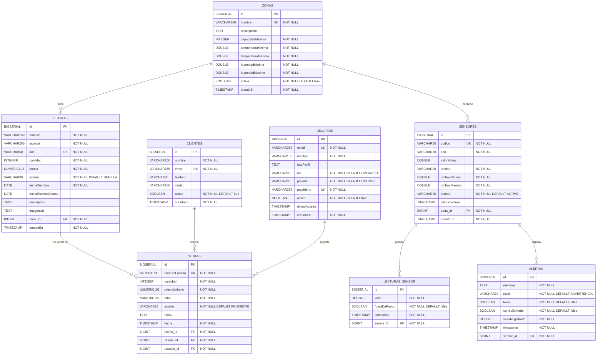

# Diagrama Entidad-Relación — GreenCore

**Sistema:** GreenCore — Gestión integral de invernadero  
**Base de datos:** PostgreSQL  
**Versión:** 1.0.0  

---

---

## Resumen de Relaciones

| Tabla origen | Cardinalidad | Tabla destino | FK en tabla destino |
|---|---|---|---|
| `zonas` | 1 → N | `plantas` | `zona_id` |
| `zonas` | 1 → N | `sensores` | `zona_id` |
| `sensores` | 1 → N | `lecturas_sensor` | `sensor_id` |
| `sensores` | 1 → N | `alertas` | `sensor_id` |
| `plantas` | 1 → N | `ventas` | `planta_id` |
| `clientes` | 1 → N | `ventas` | `cliente_id` |
| `usuarios` | 1 → N | `ventas` | `usuario_id` |
